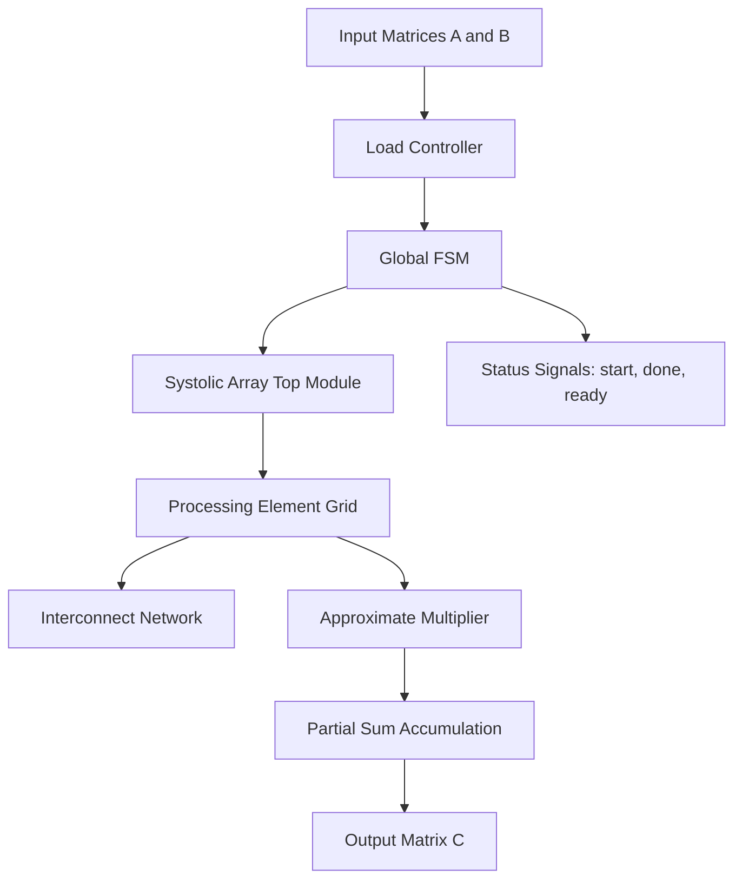
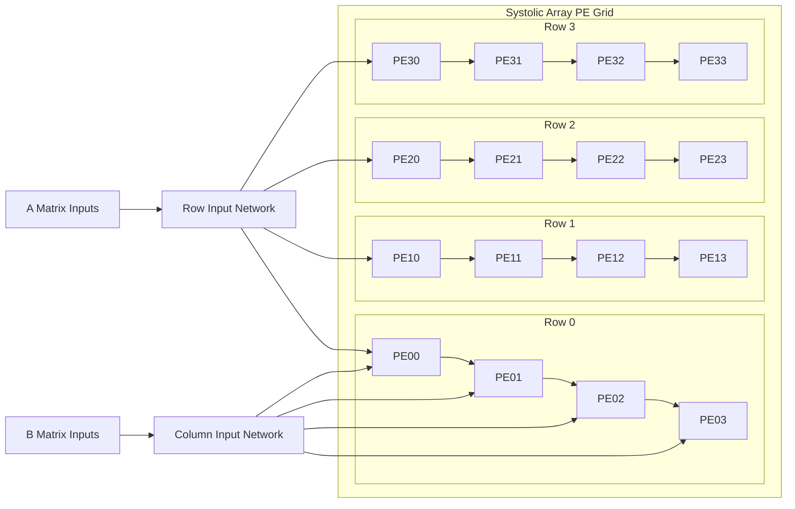
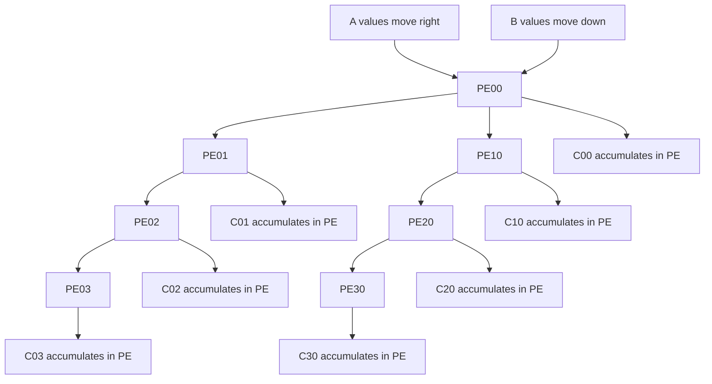
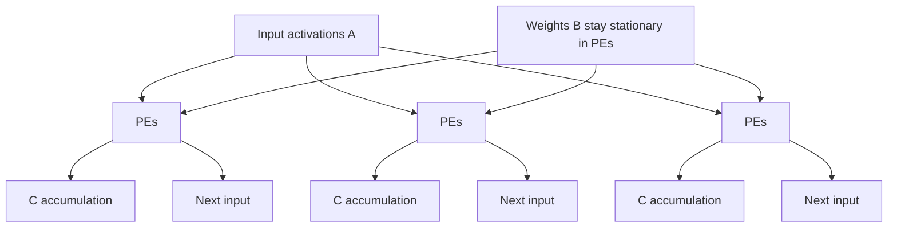
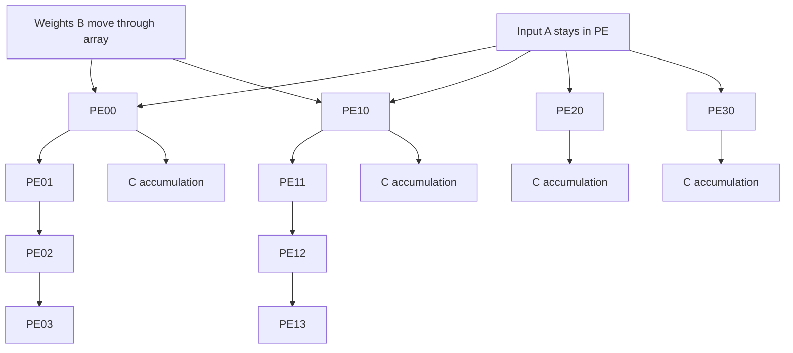
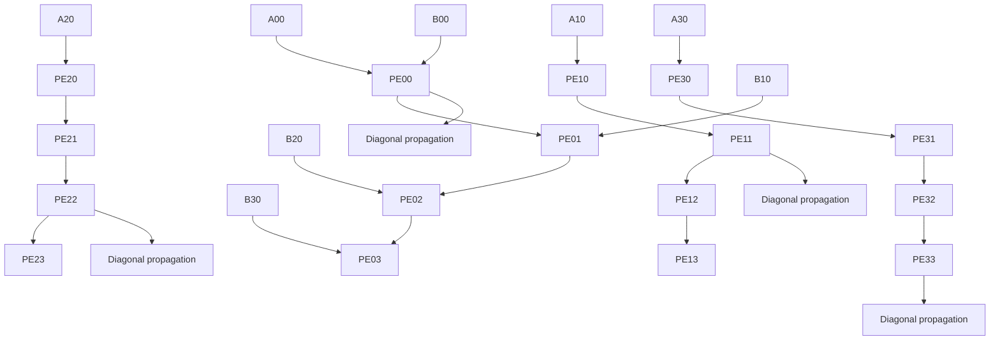
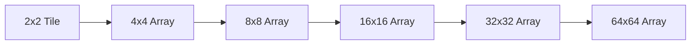
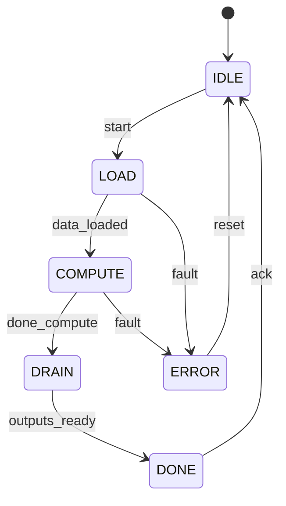

# Systolic Array Processor with Approximate Computing

[](https://opensource.org/licenses/MIT)
[](https://en.wikipedia.org/wiki/Verilog)
[](https://www.python.org/)
[](https://github.com/yourusername/systolic-array/issues)
[](https://github.com/yourusername/systolic-array/stargazers)
[](https://github.com/yourusername/systolic-array/network)

---

## Overview

**Systolic Array Processor with Approximate Computing** is a configurable hardware accelerator for high-throughput matrix operations, convolution, and tensor workloads. It combines a scalable systolic array, multiple dataflow modes, and a custom approximate multiplier to reduce power while keeping performance high.

The design is intended for:
- FPGA prototyping.
- ASIC research.
- AI/ML acceleration.
- Signal and image processing.

---

## Table of Contents

- [Overview](#overview)
- [Why Systolic Array](#why-systolic-array)
- [Key Features](#key-features)
- [Architecture Overview](#architecture-overview)
- [System Block Diagram](#system-block-diagram)
- [Processing Element](#processing-element)
- [Dataflow Techniques](#dataflow-techniques)
- [Custom Approximate Multiplier](#custom-approximate-multiplier)
- [Array Size Expansion](#array-size-expansion)
- [Global Control FSM](#global-control-fsm)
- [Supported Operations](#supported-operations)
- [Power-Efficient Model](#power-efficient-model)
- [Installation](#installation)
- [Usage](#usage)
- [Performance Metrics](#performance-metrics)
- [Testing and Verification](#testing-and-verification)
- [Future Work](#future-work)
- [Contributing](#contributing)
- [License](#license)
- [Acknowledgments](#acknowledgments)
- [Contact](#contact)

---

## Why Systolic Array

A systolic array is a regular mesh of processing elements that computes by passing data rhythmically between neighbors. This reduces memory traffic, increases reuse, and makes the architecture easier to scale.

Compared with a traditional CPU-style flow, this design is better suited for:
- Matrix multiplication.
- Convolution.
- Neural network inference.
- Streaming DSP workloads.

---

## Key Features

| Feature | Description |
|--------|-------------|
| Configurable size | 2^N × 2^N array, where N = 1 to 8 |
| Multiple dataflows | OS, WS, IS, and Axon Systolic |
| Approximate multiplier | Lower power, configurable accuracy |
| Global FSM | Centralized control for execution flow |
| Scalable design | Suitable for small to large arrays |
| Python tools | Analysis, profiling, and plotting |
| Verification support | Testbenches and waveform inspection |
| Synthesis ready | FPGA and ASIC compatible |

---

## Architecture Overview

The design is organized into a top-level controller, a 2D array of processing elements, interconnect logic, and supporting analysis scripts.

### Main modules
- `top.v`: Top-level integration.
- `pe.v`: Processing element.
- `approx_multiplier.v`: Approximate multiplier.
- `fsm.v`: Global control state machine.
- `array.v`: Systolic array interconnect.
- `tb/`: Testbench files.
- `tools/`: Python analysis scripts.

---

## System Block Diagram



This flow shows how operands enter the controller, get distributed into the array, and produce the final result.

---

## Processing Element

Each processing element performs multiply-accumulate operations and forwards values to adjacent PEs.

```verilog
module pe #(
    parameter DATA_WIDTH = 16
)(
    input  wire                   clk,
    input  wire                   rst,
    input  wire                   valid_in,
    input  wire [DATA_WIDTH-1:0]  a_in,
    input  wire [DATA_WIDTH-1:0]  b_in,
    input  wire [2*DATA_WIDTH-1:0] c_in,
    output reg  [DATA_WIDTH-1:0]  a_out,
    output reg  [DATA_WIDTH-1:0]  b_out,
    output reg  [2*DATA_WIDTH-1:0] c_out
);

    always @(posedge clk or posedge rst) begin
        if (rst) begin
            a_out <= 0;
            b_out <= 0;
            c_out <= 0;
        end else if (valid_in) begin
            a_out <= a_in;
            b_out <= b_in;
            c_out <= c_in + (a_in * b_in);
        end
    end
endmodule
```

This PE structure is simple, pipeline-friendly, and easy to replicate across the array.

---

## Dataflow Techniques

### Output Stationary (OS)

In OS mode, partial sums stay inside the PE while inputs move across the array. This reduces output movement and is efficient for standard matrix multiplication.

```verilog
always @(posedge clk) begin
    if (dataflow_mode == OS) begin
        a_out <= a_in;
        b_out <= b_in;
        c_reg <= c_reg + (a_in * b_in);
        c_out <= c_reg;
    end
end
```

### Weight Stationary (WS)

In WS mode, weights remain fixed inside the PEs while inputs stream through. This is useful for inference workloads.

```verilog
always @(posedge clk) begin
    if (dataflow_mode == WS) begin
        a_out <= a_in;
        c_reg <= c_reg + (a_in * weight_reg);
        c_out <= c_reg;
    end
end
```

### Input Stationary (IS)

In IS mode, inputs stay fixed while weights flow through the array. This is useful for streaming and filter-based applications.

```verilog
always @(posedge clk) begin
    if (dataflow_mode == IS) begin
        b_out <= b_in;
        c_reg <= c_reg + (input_reg * b_in);
        c_out <= c_reg;
    end
end
```

### Axon Systolic

In Axon mode, values propagate diagonally for high-throughput matrix multiplication.

```verilog
always @(posedge clk) begin
    if (dataflow_mode == AXON) begin
        a_out <= (i == 0) ? a_in : pe_a_in[i-1][j];
        b_out <= (j == 0) ? b_in : pe_b_in[i][j-1];
        c_reg <= c_reg + (a_out * b_out);
        c_out <= c_reg;
    end
end
```

### Dataflow Comparison


### Dataflow Comparison

| Mode | Latency | Throughput | Power | Best Use |
|------|---------|------------|-------|----------|
| OS | Medium | High | Medium | Matrix multiplication |
| WS | High | Medium | Low | DNN inference |
| IS | Medium | High | Medium | DSP / streaming |
| AXON | Low | Very High | Medium | Real-time processing |

---

## PE Array and Dataflow Propagation

### Generic PE Array Layout



### OS Data Propagation



### WS Data Propagation



### IS Data Propagation



### AXON Diagonal Feeding



### Dataflow Summary

- **OS (Output Stationary):** partial sums remain in the PE.
- **WS (Weight Stationary):** weights remain in the PE.
- **IS (Input Stationary):** inputs remain in the PE.
- **AXON:** diagonal feeding pattern for fast systolic propagation.

These modes allow the same hardware to support different workloads with different performance and power trade-offs.

---

## Custom Approximate Multiplier

The approximate multiplier reduces power and area by using approximation in lower-order bits.

### Key ideas
- LSB truncation.
- Approximate compressor logic.
- Booth-style partial products.
- Optional correction logic.

```verilog
module approx_multiplier #(
    parameter WIDTH = 16,
    parameter APPROX_BITS = 4
)(
    input  wire [WIDTH-1:0] a,
    input  wire [WIDTH-1:0] b,
    output wire [2*WIDTH-1:0] p
);

    wire [2*WIDTH-1:0] exact_product;
    assign exact_product = a * b;

    assign p = exact_product & ~((1 << APPROX_BITS) - 1);
endmodule
```

This block can be replaced by a more advanced approximate implementation if you want stronger power savings.

---

## Array Size Expansion

The array is parameterized to support power-of-two sizes.

### Supported configurations
- 2×2
- 4×4
- 8×8
- 16×16
- 32×32
- 64×64
- 128×128
- 256×256

### Expansion mechanism



The array grows by composing smaller reusable tiles, which keeps the design modular and easier to verify.

---

## Global Control FSM

The FSM manages array operation from reset to completion.



### Example FSM skeleton

```verilog
module control_fsm (
    input  wire clk,
    input  wire rst,
    input  wire start,
    input  wire compute_done,
    input  wire outputs_done,
    output reg  load_en,
    output reg  compute_en,
    output reg  drain_en,
    output reg  done
);

    typedef enum logic [2:0] {IDLE, LOAD, COMPUTE, DRAIN, DONE} state_t;
    state_t state, next_state;

    always @(posedge clk or posedge rst) begin
        if (rst) state <= IDLE;
        else state <= next_state;
    end
endmodule
```

---

## Supported Operations

The architecture supports multiple matrix and DSP workloads.

### Operations
- Matrix multiplication.
- Convolution.
- FIR filtering.
- Tensor-style multiply-accumulate operations.
- Streaming linear algebra kernels.

### Example matrix multiply flow

```verilog
// C = A x B
for (i = 0; i < M; i = i + 1) begin
    for (j = 0; j < N; j = j + 1) begin
        c[i][j] = 0;
        for (k = 0; k < K; k = k + 1) begin
            c[i][j] = c[i][j] + a[i][k] * b[k][j];
        end
    end
end
```

---

## Power-Efficient Model

The design reduces power through data reuse and approximate arithmetic.

### Techniques used
- Reduced memory movement.
- Lower switching activity.
- Approximate multiplication.
- Optional clock gating.
- Parameterized precision.

### Efficiency goals
- Lower MAC energy.
- Better TOPS/W.
- Reduced interconnect cost.
- Good accuracy for error-tolerant workloads.

---

## Installation

### Prerequisites
- Verilog/SystemVerilog simulator.
- Python 3.8+.
- GTKWave.
- Optional synthesis toolchain.

### Clone the repository

```bash
git clone https://github.com/yourusername/systolic-array.git
cd systolic-array
```

### Run simulation

```bash
make sim
```

### Run analysis tools

```bash
python3 tools/analysis/run_analysis.py
```

---

## Usage

### Configure the design
Set parameters in your config file or top module:
- `ARRAY_SIZE`
- `DATA_WIDTH`
- `DATAFLOW_MODE`
- `APPROX_BITS`

### Simulate a test case
1. Load matrix data.
2. Select a dataflow.
3. Run the simulation.
4. Compare output with the reference model.

### View waveforms

```bash
gtkwave dump.vcd
```

---

## Performance Metrics

| Metric | Description |
|--------|-------------|
| Throughput | Number of MACs per cycle or per second |
| Latency | Time from input load to valid output |
| Power | Dynamic and static power estimate |
| Accuracy | Match against exact multiplication |
| Area | RTL or synthesized resource usage |

---

## Testing and Verification

### Testbenches
- PE unit tests.
- Array integration tests.
- End-to-end matrix tests.
- Approximate multiplier checks.

### Verification flow
- Run RTL simulation.
- Compare outputs against a Python golden model.
- Inspect waveforms in GTKWave.
- Add assertions for control and timing correctness.

```bash
make test
make wave
```

---

## Future Work

Planned improvements include:
- RISC-V coprocessor integration.
- Sparse matrix support.
- Mixed-precision support.
- Fault tolerance.
- Memory hierarchy optimization.
- MLIR/TVM integration.
- ASIC tape-out exploration.

---

## Contributing

Contributions are welcome.

### Workflow
1. Fork the repository.
2. Create a feature branch.
3. Implement your changes.
4. Add tests.
5. Submit a pull request.

---

## License

This project is licensed under the MIT License. See the `LICENSE` file for details.

---

## Acknowledgments

This project is inspired by the foundational and modern work in systolic architectures, VLSI design, and accelerator-based computing.

- **H.T. Kung** for introducing and popularizing systolic architectures as a general methodology for mapping computations into regular hardware structures.
- **Charles E. Leiserson** and **H.T. Kung** for early work on systolic and VLSI-oriented computation models.
- **Google Research / Google TPU team** for demonstrating the practical impact of systolic arrays in large-scale machine learning acceleration.
- **Researchers in approximate computing** for showing how accuracy-aware arithmetic can reduce power and area in digital systems.
- **Researchers in low-power VLSI architecture** for techniques such as clock gating, data reuse, and energy-aware datapath design.
- **Researchers in dataflow-based accelerators** for Output Stationary, Weight Stationary, and Input Stationary processing models.
- **Academic and industrial work on matrix multiplication accelerators, CNN accelerators, and tensor processing engines** that helped shape modern systolic-array design practices.
- **Carnegie Mellon University and related systolic architecture research groups** for advancing the original architectural concepts.
- **The open-source hardware and EDA community** for enabling RTL design, simulation, verification, and synthesis workflows.

### Selected References
- H.T. Kung, *Why Systolic Architectures?*
- H.T. Kung and Charles E. Leiserson, early systolic/VLSI computation research.
- Jouppi et al., *In-Datacenter Performance Analysis of a Tensor Processing Unit.*
- Eyeriss-related energy-efficient accelerator research.
- Approximate computing literature on low-power arithmetic and error-tolerant design.

---

## Contact

| Role | Name | Email | GitHub |
|------|------|-------|--------|
| Project Associate | GAURAV DHAK | [GAURAVDHAK@NITGOA.AC.IN](mailto:GAURAVDHAK@NITGOA.AC.IN) | @gauravdhak |

This project was developed by me as part of my own learning, curiosity, and knowledge-building journey.
---

<div align="center">
  <sub>Built with ❤️ by the Systolic Array Team</sub>
</div>
